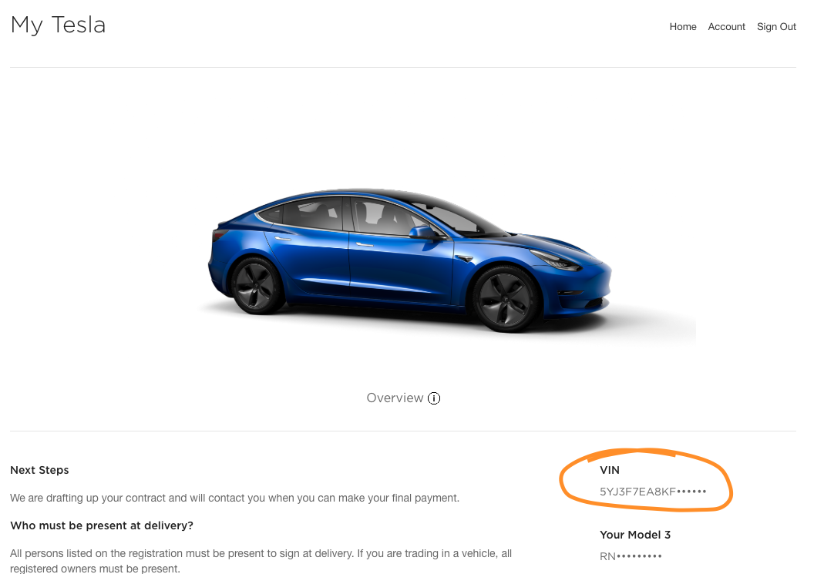

# Tesla VIN Checker Chrome Extension

Small Chrome extension to check for the presence of a VIN in the `Tesla` on the "My Tesla" page.

## Installation

 - Head to the [releases](https://github.com/benlancaster/tesla-vin-check-crx/releases) tab
 - Expand the "Assets" tab and download _either_ "Source code (zip)" or "Source code (tar.gz)" depending on your preference
 - Unpack the file to wherever you like (you can delete the zip but you need to keep the unzipped folder on your computer in the same location)
 - Head to [chrome://extensions](chrome://extensions)
 - Flick the switch that enables "Developer Mode" if it isn't already 
 - Hit the "Load unpacked" button and point the file chooser to the folder you just unzipped
 - Log in to your Tesla account as normal, head to the "Manage" page of your Tesla and you should see the VIN like so: 

## Uninstallation
 
 - Head to [chrome://extensions](chrome://extensions)
 - Click the "remove" button on the "Tesla VIN Checker" extension
 - Delete the zip file and the folder you unzipped it to

## Features:

 - Not a lot, it just looks for a VIN in the `Tesla` object on the `window` and writes it to the page
 - Doesn't use/store/save/send your login credentials anywhere 

## License

[MIT License](LICENSE.md)